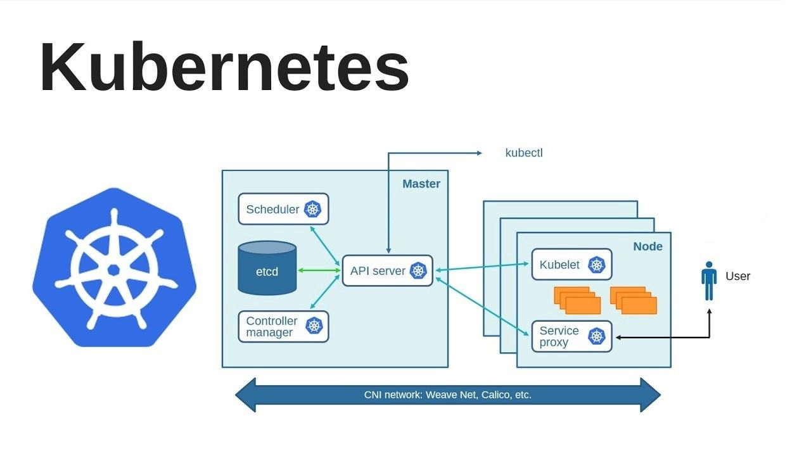
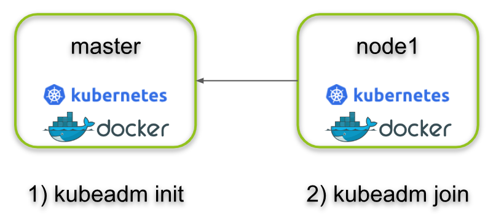

# Kubernetes Cluster Kubeadm ile Kurulum
**Kurulum** 



## kubeadm kurulum

https://kubernetes.io/docs/setup/production-environment/tools/kubeadm/install-kubeadm/

## Multipass kurulum




Multipass, bir sanal makine yönetim aracıdır ve özellikle Ubuntu tabanlı işletim sistemlerinde kullanılmak üzere tasarlanmıştır. Multipass, kullanıcıların yerel makinalarında hızlı ve basit bir şekilde sanal makineler oluşturmasına ve yönetmesine yardımcı olur. 

https://multipass.run/install

# windows makine için:
https://multipass.run/download/windows
indir ve kur sonra aşağıdaki komutla istenilen özelliklerde makine kur.Fakat makine image belirtmeyi unutma (multipass launch 20.04 --name master -c 2 -m 2G -d 10G)
20.04 diyince ubuntu 20.04 imajı yükleniyor.

**0:** sanal makine oluşturma
```
$ multipass launch --name master -c 2 -m 2G -d 10G
$ multipass launch --name node1 -c 2 -m 2G -d 10G
```
master ve node1 için terminalden içine girme "shell" ile ve sonra ip adreslerini görme:
```
multipass shell master
multipass shell node1
multipass list
```

* Master node'a bağlanıp ```sudo hostnamectl set-hostname master``` komutunu girin. node1'e bağlanıp ```sudo hostnamectl set-hostname node1``` komutunu girin.

**1:** Kernel modulleri aktive ediyor ve swap kapatıyoruz

```
$ sudo modprobe overlay
$ sudo modprobe br_netfilter
```

```
$ cat <<EOF | sudo tee /etc/modules-load.d/k8s.conf
overlay
br_netfilter
EOF
```

```
$ cat <<EOF | sudo tee /etc/sysctl.d/k8s.conf
net.bridge.bridge-nf-call-iptables  = 1
net.bridge.bridge-nf-call-ip6tables = 1
net.ipv4.ip_forward                 = 1
EOF
```

```
$ sudo sysctl --system
```

```
$ sudo swapoff -a
$ free -m
$ sudo sed -i '/ swap / s/^\(.*\)$/#\1/g' /etc/fstab
```

**Note:** DNS çözümlemesi hatası ayarı
Multipass ile açılan sanal makineler (master ve node1) Dns çözümlemede sürekli hata veriyor.
/etc/resolv.conf dosyası içeriğinde nameserver 8.8.8.8 kayıtlı değil dolayısıyla sürekli "sudo apt update" komutunda hata yeriyor. Kalıcı çözmek için "resolv.conf" içine bu nameserverları nano ile kayıt etmek lazım.
```
sudo nano /etc/resolv.conf

ikisinide kaydet kapat
nameserver 8.8.8.8
nameserver 8.8.4.4
```


**2:** containerd kurulumu

```
$ curl -fsSL https://download.docker.com/linux/ubuntu/gpg | sudo gpg --dearmor -o /usr/share/keyrings/docker.gpg
echo \
  "deb [arch=$(dpkg --print-architecture) signed-by=/usr/share/keyrings/docker.gpg] https://download.docker.com/linux/ubuntu \
  $(lsb_release -cs) stable" | sudo tee /etc/apt/sources.list.d/docker.list > /dev/null
$ sudo apt update
$ sudo apt install containerd.io
$ sudo systemctl daemon-reload
$ sudo systemctl enable --now containerd
$ sudo systemctl start containerd
$ sudo mkdir -p /etc/containerd
$ sudo su -
$ containerd config default | tee /etc/containerd/config.toml
$ exit
$ sudo sed -i 's/            SystemdCgroup = false/            SystemdCgroup = true/' /etc/containerd/config.toml
$ sudo systemctl restart containerd

```

**3:** kubeadm kurulumu

**NOTE:**
portları aşağıdaki note kısmına göre yap...

```
$ sudo ufw allow 6443/tcp
$ sudo ufw allow 2379:2380/tcp
$ sudo ufw allow 10250/tcp
$ sudo ufw allow 10259/tcp
$ sudo ufw allow 10257/tcp
$ sudo apt-get update
$ sudo apt-get install -y apt-transport-https ca-certificates curl
$ sudo curl -fsSLo /usr/share/keyrings/kubernetes-archive-keyring.gpg https://packages.cloud.google.com/apt/doc/apt-key.gpg
$ echo "deb [signed-by=/usr/share/keyrings/kubernetes-archive-keyring.gpg] https://apt.kubernetes.io/ kubernetes-xenial main" | sudo tee /etc/apt/sources.list.d/kubernetes.list
$ sudo apt-get update
$ sudo apt-get install -y kubelet kubeadm kubectl
$ sudo apt-mark hold kubelet kubeadm kubectl
```

**NOTE:** port ayarları 

## master node için:
```
sudo ufw allow 6443/tcp
sudo ufw allow 2379:2380/tcp
sudo ufw allow 10250/tcp
sudo ufw allow 10259/tcp
sudo ufw allow 10257/tcp
sudo ufw allow 22/tcp
sudo ufw allow 8472/udp
```
## node1 için:
```
sudo ufw allow 6443/tcp
sudo ufw allow 30000:32767/tcp
sudo ufw allow 22/tcp
sudo ufw allow 8472/udp
```
buraya kadar her iki makinede de yukarıdaki komutlar çalıştırılacak.
Buradan sonraki komutlar master node da çalıştırılacak...

**4:** kubernetes cluster kurulumu

```
$ sudo kubeadm config images pull

$ sudo kubeadm init --pod-network-cidr=192.168.0.0/16 --apiserver-advertise-address=<ip> --control-plane-endpoint=<ip>
```

```
$ mkdir -p $HOME/.kube
$ sudo cp -i /etc/kubernetes/admin.conf $HOME/.kube/config
$ sudo chown $(id -u):$(id -g) $HOME/.kube/config
```

```
$ kubectl create -f https://raw.githubusercontent.com/projectcalico/calico/v3.25.1/manifests/tigera-operator.yaml
$ kubectl create -f https://raw.githubusercontent.com/projectcalico/calico/v3.25.1/manifests/custom-resources.yaml
```

```
kubectl get nodes
kubectl get pods -n kube-system
kubectl get pods -n kube-system -o wide
kubectl get services
```


```
kubectl taint nodes --all node-role.kubernetes.io/control-plane-
kubectl taint nodes --all node-role.kubernetes.io/master-
```


## Deploying a Simple Nginx Server on Kubernetes

- Check the readiness of nodes at the cluster on master node.

```bash
kubectl get nodes
```

- Show the list of existing pods in default namespace on master. Since we haven't created any pods, list should be empty.

```bash
kubectl get pods
```

- Get the details of pods in all namespaces on master. Note that pods of Kubernetes service are running on the master node and also additional pods are running on the worker nodes to provide communication and management for Kubernetes service.

```bash
kubectl get pods -o wide --all-namespaces
```

- Create and run a simple `Nginx` Server image.

```bash
kubectl run nginx-server --image=nginx  --port=80
```

- Get the list of pods in default namespace on master and check the status and readyness of `nginx-server`

```bash
kubectl get pods -o wide
```

- Expose the nginx-server pod as a new Kubernetes service on master.

```bash
kubectl expose pod nginx-server --port=80 --type=NodePort
```

- Get the list of services and show the newly created service of `nginx-server`

```bash
kubectl get service -o wide
```

- You will get an output like this.

```text
kubernetes     ClusterIP   10.96.0.1       <none>        443/TCP        13m    <none>
nginx-server   NodePort    10.110.144.60   <none>        80:32276/TCP   113s   run=nginx-server
```

- Open a browser and check the `master node ip:<NodePort>` of worker node to see Nginx Server is running. In this example, NodePort is 32276.
